＃Timelane

Xcode の Instruments を活用して  
Combine のデータの流れをヴィジュアライズするツールです。  
(RxSwift など他の Rx ライブラリにも利用できます。)

https://github.com/icanzilb/Timelane

Timelane について作者の方が解説している動画です。  
[Fixing your Combine code with the Timelane Instrument](https://www.youtube.com/watch?v=QfGZUfLw5AA)

# セットアップ

※　今回は Swift Package Manager を利用しますが  
Carthage や Cocoapods でも利用可能です

## Instruments テンプレートのインストール

[インストールページ](https://github.com/icanzilb/Timelane/releases)より最新の app ファイルをダウンロードします。

ダウンロードしたファイルを開いたページの  
② に従ってテンプレートをダウンロードします。

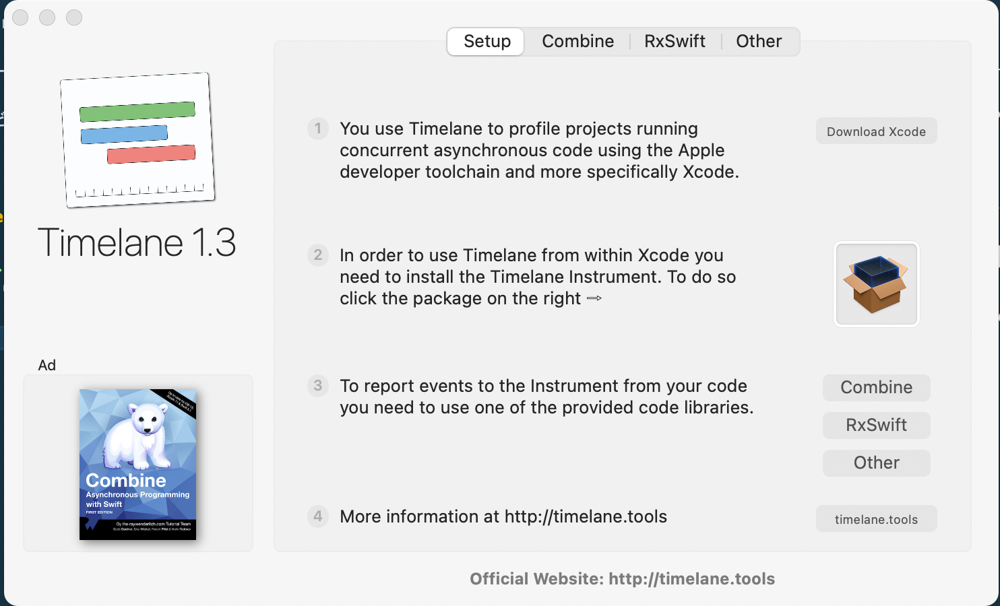
 
 
 
正常にインストールされると下記のようにメニューの中に出てきます。

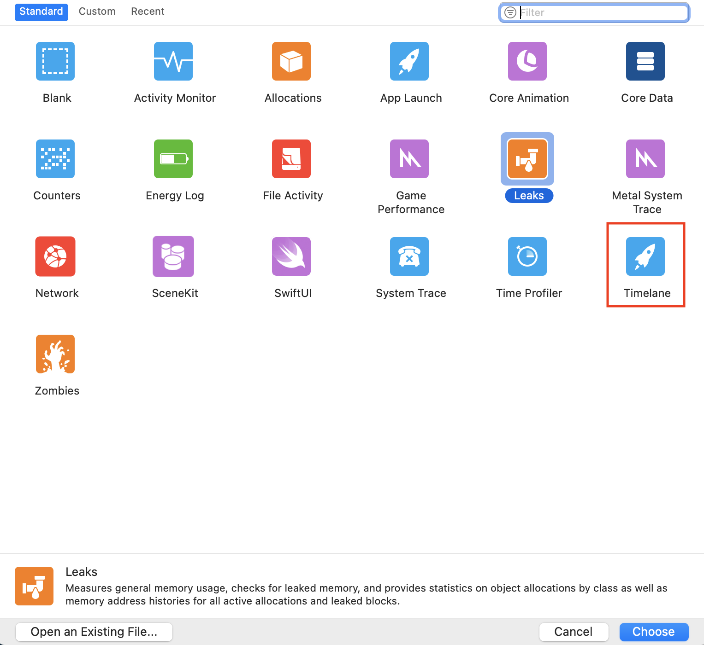

 
 

## プロジェクトへの設定

③ で Combine を選択すると  
プロジェクトへの設定方法が出てくるので  
これに従ってプロジェクトに追加します。

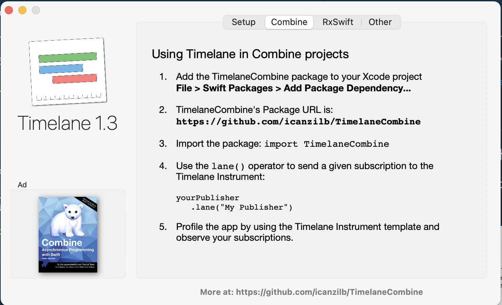

### 1. Swift Package Manager を選択

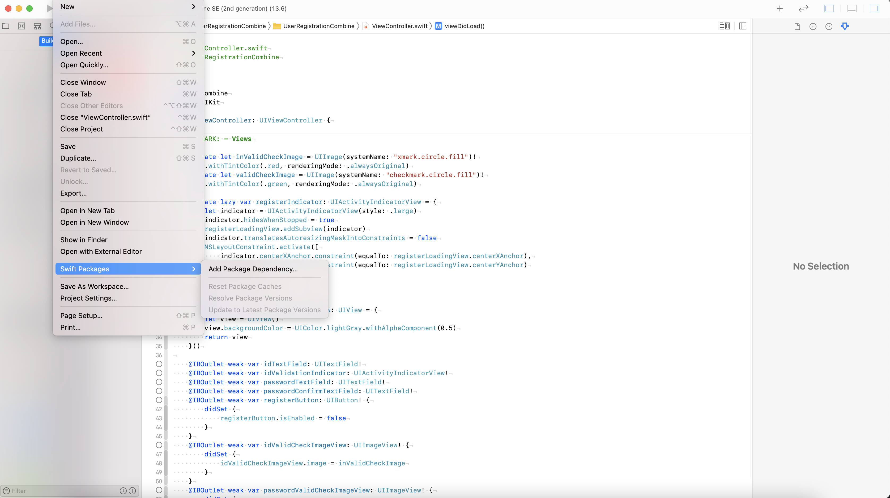

### 2. URL を入力して Next を押す

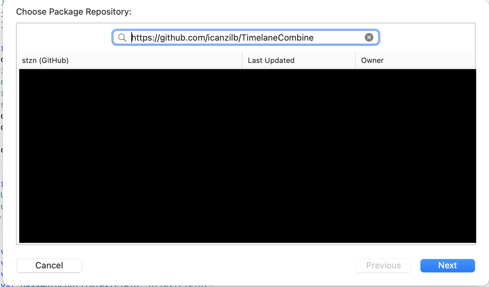

### 3. Next を押す(設定はそのままで良いと思います)

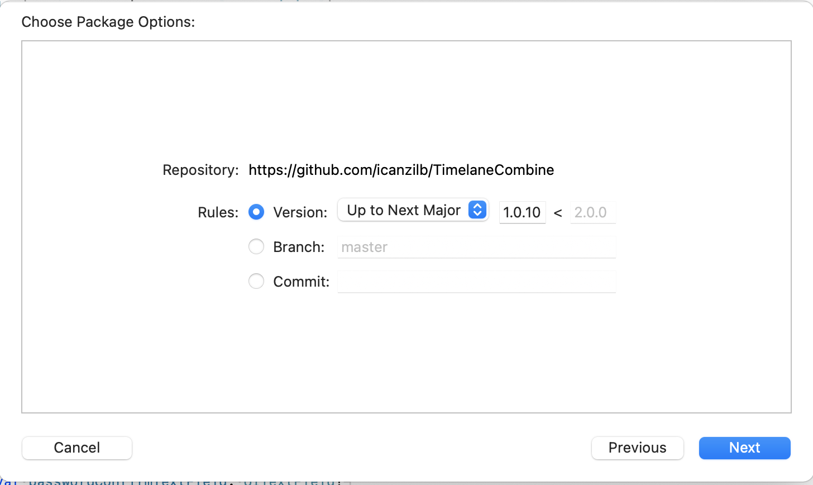

### 4. 正しいライブラリが設定されいることを確認し Finish を押す

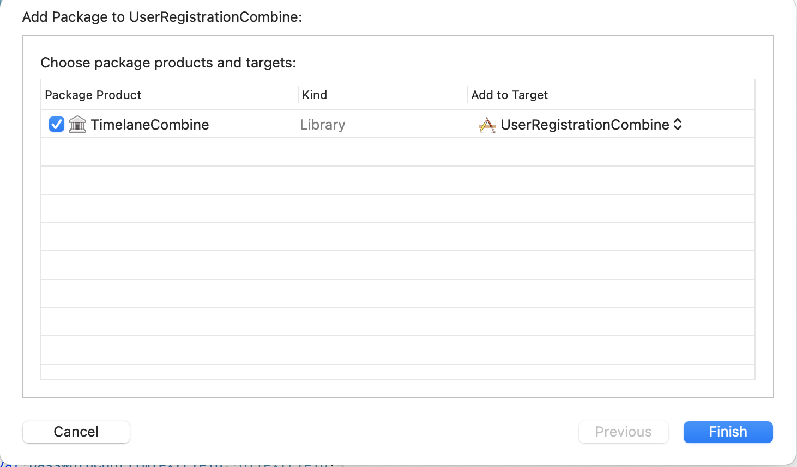

### 5. 正しくインストールされてれば下記のようにプロジェクト内に出てきます。

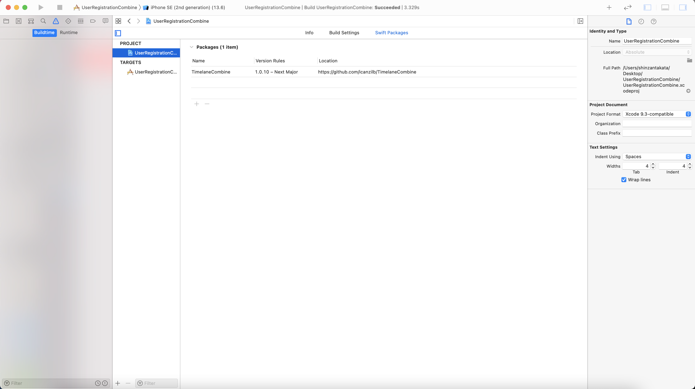

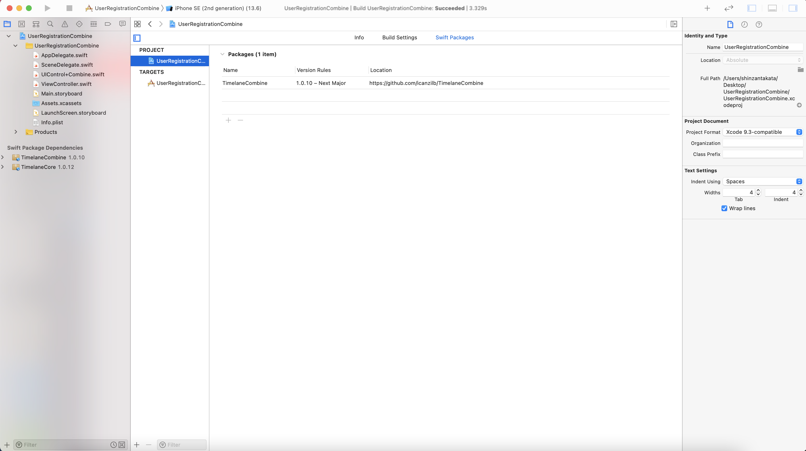

## 使用方法

### TimelaneCombine をインポートする

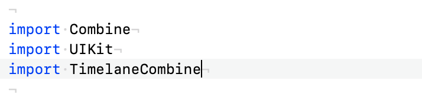

### チェックしたい Publisher から lane メソッドを呼ぶ

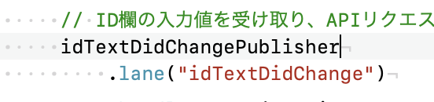

### Instruments を起して（Cmd + I）を Timelane を選択する

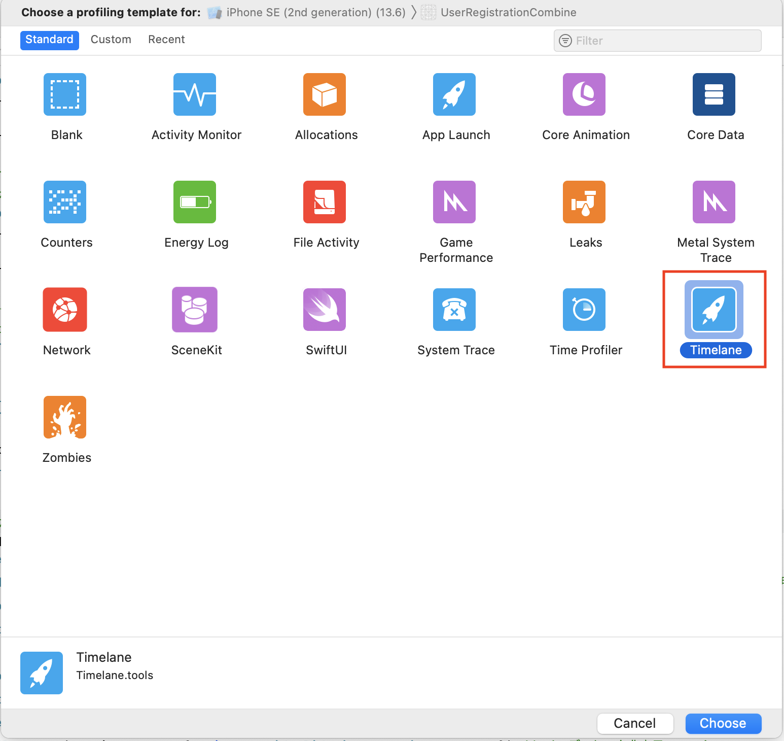

### 左上のスタートボタンを押す

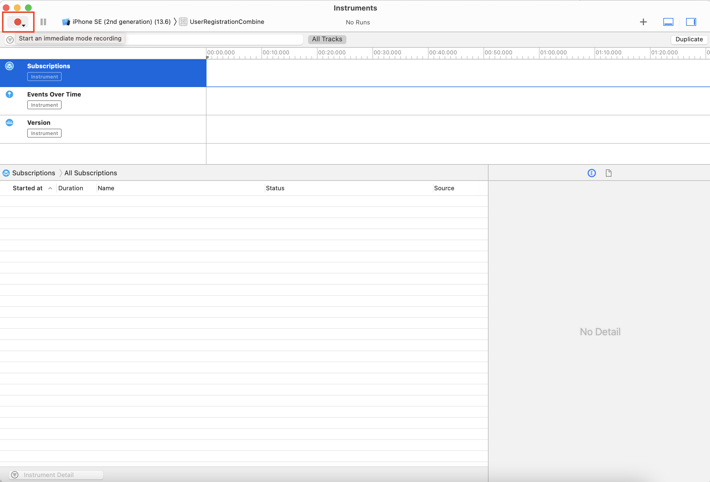

### アプリの操作を行うと Publisher の出力結果が表示される

下記のケースは TextField に値を入力すると  
Publisher から Output が出力されています。

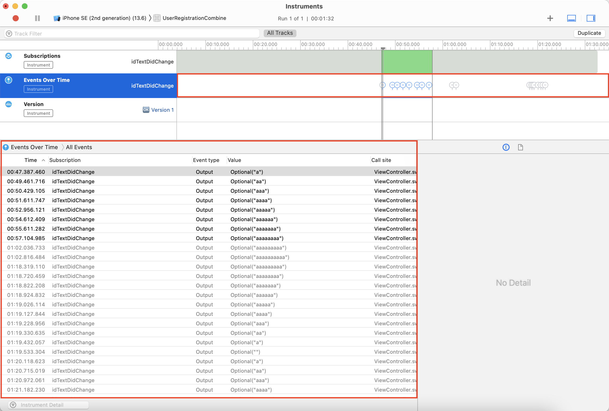
